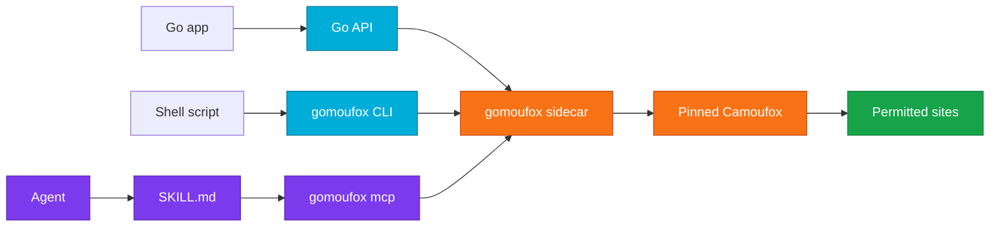

# gomoufox

<p align="center">
  
  
  
  
  
</p>

gomoufox is a Go driver for Camoufox.

It gives Go programs, shell scripts, and MCP agents a typed way to launch and
control the pinned Camoufox browser stack without writing Python glue.

Use it only on sites you own, test, or have permission to automate.

## At a glance

| Need | Use |
|---|---|
| Go browser automation | `github.com/ehmo/gomoufox` |
| Shell automation | `gomoufox get`, `gomoufox screenshot`, `gomoufox fetch` |
| Agent browser tools | `gomoufox mcp` |
| Agent instructions | `gomoufox skills list`, `show`, `export`, `install` |
| Release evidence | [docs/BENCHMARKS.md](docs/BENCHMARKS.md) |



## Install

Library:

```bash
go get github.com/ehmo/gomoufox
```

CLI:

```bash
go install github.com/ehmo/gomoufox/cmd/gomoufox@latest
gomoufox install
gomoufox doctor
```

Homebrew:

```bash
brew tap ehmo/gomoufox https://github.com/ehmo/gomoufox
brew install gomoufox
gomoufox install
gomoufox doctor
```

`gomoufox install` creates a managed Python environment, installs the pinned
Camoufox package, and fetches the pinned browser binary. Go callers still use the
Go API and CLI. The Python environment is runtime plumbing for Camoufox.

Use `GOMOUFOX_CAMOUFOX_PATH` when you already have a compatible Camoufox browser
directory and want gomoufox to use it instead of the managed one.

## Go library

```go
package main

import (
	"context"
	"fmt"

	gomoufox "github.com/ehmo/gomoufox"
)

func main() {
	ctx := context.Background()

	browser, err := gomoufox.New(ctx)
	if err != nil {
		panic(err)
	}
	defer browser.Close()

	page, err := browser.NewPage(ctx)
	if err != nil {
		panic(err)
	}

	if _, err := page.Goto(ctx, "https://example.com"); err != nil {
		panic(err)
	}

	text, err := page.Content(ctx)
	if err != nil {
		panic(err)
	}
	fmt.Println(text)
}
```

Use the library when your program owns the browser lifecycle. Use the CLI when a
shell script needs a page snapshot, screenshot, or browser-context fetch. Use MCP
when an agent needs browser tools over stdio or HTTP.

## CLI

```bash
gomoufox get https://example.com --markdown
gomoufox screenshot https://example.com --out page.png --full-page
gomoufox fetch https://api.example.com/me --navigate-first https://example.com
```

Fetch responses are read through a bounded browser stream. `gomoufox fetch`
defaults to 512 KiB, reports truncation in JSON output, and cancels the reader
when the cap is reached.

Agent-friendly discovery:

```bash
gomoufox help
gomoufox help --json --fields commands
gomoufox help skills --json
gomoufox help mcp --json
gomoufox skills list --json
gomoufox skills show core
gomoufox mcp --help
```

Automation tips:

- Use `--json` for machine-readable output and keep status logs on stderr.
- Use `--timeout <dur>` for bounded shell jobs.
- Use `--profile <dir>` when a workflow needs persistent browser state.
- Keep the default URL policy for normal work. Use `--allow-private-ips` only
  when you need local or private network targets.

## Skills

gomoufox ships versioned agent skills in the binary and as checked `SKILL.md`
files. Skills give agents a compact operating guide for the Go API, CLI, and MCP
tools. They do not install npm packages, run `npx`, or call the network.

| Skill | Path | Use it when |
|---|---|---|
| `core` | `skills/gomoufox/SKILL.md` | An agent needs the Go library or CLI workflow. |
| `mcp` | `skills/gomoufox-mcp/SKILL.md` | An agent needs MCP setup, tool choice, and browser safety rules. |

Inspect the embedded skills:

```bash
gomoufox skills list --json
gomoufox skills show core
gomoufox skills show mcp
```

Export installable copies:

```bash
gomoufox skills export --out ./skills
gomoufox skills export --out ./skills --force
```

Install them for Codex:

```bash
gomoufox skills install --target codex --dry-run --json
gomoufox skills install --target codex
```

By default, the Codex target writes to `$CODEX_HOME/skills` or
`~/.codex/skills`. Use `--dir <path>` to choose another skill directory. The
installer writes:

- `gomoufox/SKILL.md`
- `gomoufox/agents/openai.yaml`
- `gomoufox-mcp/SKILL.md`
- `gomoufox-mcp/agents/openai.yaml`

`list` and `show` read from the embedded skill bodies, so agents can discover
the right instructions even when no skill directory exists yet. `export` and
`install` write the same checked bodies that ship in the repo. Existing files are
left alone unless you pass `--force`.

## MCP

Run browser tools over stdio:

```bash
gomoufox mcp
```

Claude Code example:

```bash
claude mcp add gomoufox -- gomoufox mcp
```

HTTP transport requires a bearer token:

```bash
gomoufox mcp --transport http --auth-token "$TOKEN"
```

MCP defaults:

- Use `gomoufox mcp --toolset core` for a smaller agent tool surface. It keeps
  navigation, snapshots/content, common form actions, sessions, and skill tools.
  The default `full` toolset keeps diagnostics, eval, fetch, cookies, storage,
  upload, and other gated tools available.
- `file://`, private IP ranges, link-local addresses, and metadata hosts are
  blocked.
- JavaScript evaluation is disabled unless you start MCP with `--enable-eval`.
- Response sizes are capped.
- MCP-owned helper scripts use a startup-probed internal helper evaluation path
  and do not install a page-visible helper object.
- Browser-derived MCP responses include `provenance.trust: "untrusted"` so
  agents can separate website content from trusted instructions. This label helps
  agent policy. It is not a sandbox.
- Console, page-error, network, and performance diagnosis tools are bounded,
  redacted, and clearable where they keep event buffers. Network summaries do
  not include request or response bodies.
- Ref-based interaction tools cover click, type, key press, hover, scroll,
  select option, checkbox/radio state, dialog policy, and bounded form batches.
- `browser_snapshot` form values stay redacted unless you start MCP with
  `--allow-snapshot-values` and the tool call sets `include_values: true`.
- Browser-context fetches, cookie values, cookie mutation, session export,
  session import, session proxy use, and file upload stay disabled unless you
  enable their matching operator flags.
- `browser_upload_file` requires `--allow-file-upload`; paths must resolve under
  `--session-dir`, and responses do not echo file paths.
- `browser_fetch` requires `--allow-browser-fetch` plus at least one
  `--allowed-origins` or `--allowed-hosts` entry. It still uses gomoufox network
  policy, so private and metadata destinations stay blocked.

## Benchmarks

gomoufox includes a repeatable benchmark that runs gomoufox and Python Camoufox
against the same real-site target set and records outcomes, wall time, peak RSS,
peak CPU, resource ratios, and estimated report-token footprint.
The parity run uses generated personas and `--unsafe-direct-network`; local URL
guardrails are tested by separate CLI and MCP tests.

Latest checked baseline: see [docs/BENCHMARKS.md](docs/BENCHMARKS.md).

| Runtime | Passed | Blocked | Failed | Wall ms | Peak RSS MiB | Peak CPU % | Report tokens |
|---|---:|---:|---:|---:|---:|---:|---:|
| gomoufox | 95 | 5 | 0 | 370,799 | 4,483.4 | 391.1 | 13,004 |
| Python Camoufox | 95 | 5 | 0 | 437,249 | 4,498.6 | 448.2 | 46,442 |

Latest extended validation: 100 targets, 45s timeout, `commit` wait, 3s settle,
no screenshots, built gomoufox realpass binary, reused browser, compact Go
report, 0s extra load-state wait, and 250,000-byte classification cap.
Both runtimes passed 95, blocked 5, failed 0, with zero outcome mismatches. See
[docs/benchmarks/2026-06-05-release-gate.json](docs/benchmarks/2026-06-05-release-gate.json).

| Ratio | Go / Python |
|---|---:|
| Wall time | 0.848 |
| Peak RSS | 0.997 |
| Peak CPU | 0.873 |
| Report tokens | 0.280 |

Serial wall time varies because Firefox dominates the run. The checked wins are
lower wall time, lower CPU, and a smaller agent report. RSS is effectively parity
in the release-gate run. Treat a report-token ratio above 0.50 as a regression.

```bash
scripts/benchmark-realpass.py --mode smoke
scripts/benchmark-realpass.py --mode extended --list-targets
```

For a new checked baseline, run full mode with `--update-doc docs/BENCHMARKS.md`
and commit the generated JSON under `docs/benchmarks/`.

Use `--mode extended` for the 100-target matrix before release candidates or
major browser, sidecar, MCP, CLI, or resource-related changes. The catalog lives
in `scripts/realpass-targets.json`; the runner also accepts `--max-targets <n>`
for bounded investigations.

Release gates fail on Go-only blocked, failed, or missing targets; Go/Python
outcome mismatches that reproduce on retry; missing required targets; peak RSS or
CPU over budget; and Go wall time, target duration, RSS, CPU, or report-token
ratios over the thresholds in [docs/BENCHMARKS.md](docs/BENCHMARKS.md).
In release mode, a new shared block or failure gets one focused retry. That retry
must confirm Go/Python outcome parity; the full-run resource, timing,
required-target, and token budgets still apply.

## Common questions

### Do I still need Python?

Yes, for the managed Camoufox runtime. `gomoufox install` creates the venv and
pins the Camoufox package. Your application code can stay in Go.

### Why use gomoufox instead of Python Camoufox directly?

Use gomoufox when you need a typed Go API, a scriptable CLI, MCP tools for
agents, release-gated Go/Python parity checks, and local URL guardrails. Use
Python Camoufox directly when your project is already Python-first and does not
need those surfaces.

### Will every protected site work?

No. gomoufox tests against Python Camoufox on the same target set. A Go-only
block or failure is a gomoufox regression. A shared block means both stacks saw
the same site behavior during that run. Site policy, traffic reputation, browser
changes, and upstream Camoufox changes can still affect results.

### Where does browser state live?

Temporary sessions use temporary profile data. Persistent sessions use the
directory you pass with `--profile`. MCP session import, export, proxy use, and
file upload stay disabled until you start MCP with the matching operator flags.

### Does MCP trust page content?

No. Browser-derived MCP responses carry `provenance.trust: "untrusted"`. Agents
should treat page text as data from the site, not instructions from the operator.

### Can I run headful on Linux?

Yes, if a display exists. Set `GOMOUFOX_AUTO_DISPLAY=1` when you want gomoufox to
use an automatic display helper.

### How do I debug install issues?

Run:

```bash
gomoufox doctor
gomoufox doctor --json
gomoufox --verbose doctor
```

Check `GOMOUFOX_CAMOUFOX_PATH` only when you intentionally bypass the managed
runtime.

## Compatibility

gomoufox pins the browser stack. Upgrade these pieces together.

| gomoufox | playwright-go | Playwright in venv | Camoufox package | Camoufox browser |
|---|---|---|---|---|
| v0.1.x | v0.5700.1 | 1.57.0 | 0.4.11 | v135.0.1-beta.24 |

Auto-fetch support is verified for macOS arm64. Other platforms may work with a
pre-provisioned browser directory through `GOMOUFOX_CAMOUFOX_PATH`.

Headful Linux runs need an existing display or `GOMOUFOX_AUTO_DISPLAY=1`.

## Development

```bash
go test -count=1 ./...
go test -race -count=1 ./...
go vet ./...
python3 scripts/check-agent-contracts.py
python3 scripts/format-doc-numbers.py
go run golang.org/x/vuln/cmd/govulncheck@v1.3.0 ./...
```

Agent-facing CLI and MCP discovery snapshots live in `docs/agent-contracts/`.
When CLI help or MCP tool schemas change, run
`python3 scripts/check-agent-contracts.py --update` and review the diff.

Run `python3 scripts/format-doc-numbers.py --write` after editing docs with
large displayed numbers.

The public repo is generated. Do not edit generated public files by hand.

## License

gomoufox is MIT licensed.

Camoufox is MPL-2.0. gomoufox starts Camoufox as a subprocess and downloads its
browser binary at runtime. gomoufox does not vendor or modify Camoufox.
