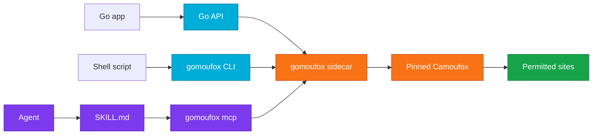

# gomoufox

<p align="center">
  
  
  
  
  
</p>

gomoufox is a Go driver for Camoufox.

It gives Go programs, shell scripts, and MCP agents a typed way to launch and
control the pinned Camoufox browser stack without writing Python glue.

Use it only on sites you own, test, or have permission to automate.

## Add gomoufox to an agent

Install the bundled skills and MCP server config in one step:

```bash
gomoufox setup --dry-run
gomoufox setup --target all --features skills,mcp --yes
gomoufox agents install --target all --features skills,mcp --dry-run --json
gomoufox agents install --target all --features skills,mcp
```

Use `--target codex`, `claude`, `cursor`, or `gemini` to install for one
agent. Use `--scope project` when you want repo-local MCP config. The default
writes skill files plus a stdio MCP entry that runs
`gomoufox mcp --toolset core`.

Run the dry run first. It prints the exact files gomoufox would write.

## At a glance

| Need | Use |
|---|---|
| Go browser automation | `github.com/ehmo/gomoufox` |
| Shell automation | `gomoufox get`, `gomoufox screenshot`, `gomoufox fetch` |
| Agent browser tools | `gomoufox mcp` |
| Guided setup | `gomoufox setup`, `gomoufox agents install` |
| Release evidence | [docs/BENCHMARKS.md](docs/BENCHMARKS.md) |



## Install

Library:

```bash
go get github.com/ehmo/gomoufox
```

CLI:

```bash
go install github.com/ehmo/gomoufox/cmd/gomoufox@latest
gomoufox -h
gomoufox install
gomoufox doctor
```

Homebrew:

```bash
brew tap ehmo/gomoufox https://github.com/ehmo/gomoufox
if brew commands | grep -qx trust; then
  brew trust --formula ehmo/gomoufox/gomoufox
fi
brew install gomoufox
gomoufox install
gomoufox doctor
```

Install through the tap. The release `gomoufox.rb` file is there for audit and
tap metadata; Homebrew wants formulae inside taps. Run `brew trust` only if your
Homebrew build still has that command.

| Path | Status | Use it when |
|---|---|---|
| `gomoufox install` |  | You want the Go-managed node-direct runtime. |
| `gomoufox install --runtime python` |  | You need BrowserForge, geoip, or the old Python sidecar. |
| `GOMOUFOX_CAMOUFOX_PATH=/path/to/browser` |  | You already have a compatible Camoufox browser directory. |

Normal Go, CLI, and MCP use does not require Python. The default install fetches
Playwright's Node driver, gomoufox's launch server, and the pinned Camoufox
browser archive.

Use `gomoufox install --runtime python` only for the explicit legacy
Python-sidecar path. That path uses hash-locked wheels and fails closed on a
missing wheel or hash mismatch.

Homebrew installs on macOS Apple Silicon and Linux amd64, because those are the
hosts where the pinned browser has an upstream binary. Other Go archives still
ship for library and CLI users.

Use `GOMOUFOX_TRUST_UNVERIFIED_CAMOUFOX_PATH=1` only for a trusted local browser
build that does not match the release manifest. `gomoufox doctor` reports that
as a warning.

## Go library

```go
package main

import (
	"context"
	"fmt"

	gomoufox "github.com/ehmo/gomoufox"
)

func main() {
	ctx := context.Background()

	browser, err := gomoufox.New(ctx)
	if err != nil {
		panic(err)
	}
	defer browser.Close()

	page, err := browser.NewPage(ctx)
	if err != nil {
		panic(err)
	}

	if _, err := page.Goto(ctx, "https://example.com"); err != nil {
		panic(err)
	}

	text, err := page.Content(ctx)
	if err != nil {
		panic(err)
	}
	fmt.Println(text)
}
```

Use the library when your program owns the browser lifecycle. Use the CLI when a
shell script needs a page snapshot, screenshot, or browser-context fetch. Use MCP
when an agent needs browser tools over stdio or HTTP.

## CLI

```bash
gomoufox get https://example.com --markdown
gomoufox screenshot https://example.com --out page.png --full-page
gomoufox fetch https://api.example.com/me --navigate-first https://example.com
```

Fetch responses are read through a bounded browser stream. `gomoufox fetch`
defaults to 512 KiB, reports truncation in JSON output, and cancels the reader
when the cap is reached.

Agent-friendly discovery:

```bash
gomoufox -h
gomoufox -v
gomoufox version
gomoufox help
gomoufox help --json --fields commands
gomoufox help skills --json
gomoufox help mcp --json
gomoufox skills list --json
gomoufox skills show core
gomoufox mcp --help
```

Automation tips:

- Use `--json` for machine-readable output and keep status logs on stderr.
- Use `--timeout <dur>` for bounded shell jobs.
- Use `--profile <dir>` when a workflow needs persistent browser state.
- Keep the default URL policy for normal work. Use `--allow-private-ips` only
  when you need local or private network targets.

## Skills

gomoufox ships versioned agent skills in the binary and as checked `SKILL.md`
files. Skills give agents a compact operating guide for the Go API, CLI, and MCP
tools. They do not install npm packages, run `npx`, or call the network.

| Skill | Path | Use it when |
|---|---|---|
| `core` | `skills/gomoufox/SKILL.md` | An agent needs the Go library or CLI workflow. |
| `mcp` | `skills/gomoufox-mcp/SKILL.md` | An agent needs MCP setup, tool choice, and browser safety rules. |

Inspect the embedded skills:

```bash
gomoufox skills list --json
gomoufox skills show core
gomoufox skills show mcp
```

Export installable copies:

```bash
gomoufox skills export --out ./skills
gomoufox skills export --out ./skills --force
```

Install skill files only for Codex:

```bash
gomoufox skills install --target codex --dry-run --json
gomoufox skills install --target codex
```

By default, the Codex target writes to `$CODEX_HOME/skills` or
`~/.codex/skills`. Use `--dir <path>` to choose another skill directory. The
installer writes:

- `gomoufox/SKILL.md`
- `gomoufox/agents/openai.yaml`
- `gomoufox-mcp/SKILL.md`
- `gomoufox-mcp/agents/openai.yaml`

`list` and `show` read from the embedded skill bodies, so agents can discover
the right instructions even when no skill directory exists yet. `export` and
`install` write the same checked bodies that ship in the repo. Existing files are
left alone unless you pass `--force`.

Install skills plus MCP configuration for a specific agent or project:

```bash
gomoufox agents install --target all --dry-run --json
gomoufox agents install --target cursor --scope project --features skills,mcp
```

`agents install` supports `codex`, `claude`, `cursor`, `gemini`, or `all`, with
`--scope user|project` and `--features skills,mcp`. MCP entries use stdio and
default to `gomoufox mcp --toolset core`. Use `--toolset full` for the full MCP
surface. Reserve repeated `--mcp-arg <arg>` for extra MCP server flags. Use
`--force` only when you want to replace existing skill files or rewrite merged
MCP config.

| Target | User-scope MCP file | Project-scope MCP file | Skill root |
|---|---|---|---|
| `codex` | `~/.codex/config.toml` | `.codex/config.toml` | `~/.agents/skills` or `.agents/skills` |
| `claude` | `~/.claude/mcp.json` | `.mcp.json` | `~/.claude/skills` or `.claude/skills` |
| `cursor` | `~/.cursor/mcp.json` | `.cursor/mcp.json` | `~/.agents/skills` or `.agents/skills` |
| `gemini` | `~/.gemini/settings.json` | `.gemini/settings.json` | `~/.agents/skills` or `.agents/skills` |

Dry-run output shows the exact absolute paths that would be written.

## MCP

Run browser tools over stdio:

```bash
gomoufox mcp
```

Claude Code example:

```bash
claude mcp add gomoufox -- gomoufox mcp
```

HTTP transport requires a bearer token:

```bash
gomoufox mcp --transport http --auth-token "$TOKEN"
```

MCP defaults:

- Use `gomoufox mcp --toolset core` for a smaller agent tool surface. It keeps
  navigation, snapshots/content, common form actions, sessions, and skill tools.
  The default `full` toolset keeps diagnostics, eval, fetch, cookies, storage,
  upload, and other gated tools available.
- `file://`, private IP ranges, link-local addresses, and metadata hosts are
  blocked.
- JavaScript evaluation is disabled unless you start MCP with `--enable-eval`.
- Response sizes are capped.
- MCP-owned helper scripts use a startup-probed internal helper evaluation path
  and do not install a page-visible helper object.
- Browser-derived MCP responses include `provenance.trust: "untrusted"` so
  agents can separate website content from trusted instructions. This label helps
  agent policy. It is not a sandbox.
- Console, page-error, network, and performance diagnosis tools are bounded,
  redacted, and clearable where they keep event buffers. Network summaries do
  not include request or response bodies.
- Ref-based interaction tools cover click, type, key press, hover, scroll,
  select option, checkbox/radio state, dialog policy, and bounded form batches.
- `browser_snapshot` form values stay redacted unless you start MCP with
  `--allow-snapshot-values` and the tool call sets `include_values: true`.
- Browser-context fetches, cookie values, cookie mutation, session export,
  session import, session proxy use, and file upload stay disabled unless you
  enable their matching operator flags.
- `browser_upload_file` requires `--allow-file-upload`; paths must resolve under
  `--session-dir`, and responses do not echo file paths.
- `browser_fetch` requires `--allow-browser-fetch` plus at least one
  `--allowed-origins` or `--allowed-hosts` entry. It still uses gomoufox network
  policy, so private and metadata destinations stay blocked.

## Benchmarks

The benchmark answers one question: did the Go path stay close to Python
Camoufox without producing Go-only failures?


Latest checked evidence:
[docs/BENCHMARKS.md](docs/BENCHMARKS.md),
[Python-sidecar artifact](docs/benchmarks/2026-06-08-release-gate.json), and
[node-direct artifact](docs/benchmarks/2026-06-09-node-direct-readiness.json).

| Runtime | Passed | Blocked | Failed | Wall ms | Peak RSS MiB | Peak CPU % | Report tokens |
|---|---:|---:|---:|---:|---:|---:|---:|
| Python Camoufox | 95 | 5 | **0** | **357,093** | 3,256.4 | 482.1 | 81,801 |
| gomoufox, Python sidecar | 95 | 5 | **0** | 366,338 | **2,765.3** | 569.9 | 13,059 |
| gomoufox, node-direct Go | **96** | **4** | **0** | 359,088 | 3,041.3 | **399.0** | **12,824** |

Bold means best in that column. The sidecar row comes from the previous extended
release-gate artifact; node-direct comes from the readiness artifact.
Use the table for direction, not single-run timing claims.

Latest extended validation: 100 targets, 60s timeout, `commit` wait, 3s settle,
no screenshots, reused browser, compact Go report, 0s extra load-state wait, and
250,000-byte classification cap.
gomoufox passed 96, blocked 4, failed 0. Python Camoufox passed 95, blocked 5,
failed 0. The run had 0 Go-only regressions and 1 Python-only outcome
difference. See
[docs/benchmarks/2026-06-09-node-direct-readiness.json](docs/benchmarks/2026-06-09-node-direct-readiness.json).

| Ratio | node-direct Go / Python Camoufox |
|---|---:|
| Wall time | 1.006 |
| Peak RSS | 0.934 |
| Peak CPU | 0.828 |
| Report tokens | 0.157 |

Wall time stayed at parity. Node-direct used less RSS, less CPU, and produced a
much smaller agent report. Treat a report-token ratio above 0.50 as a regression.
Release gates use `--unsafe-direct-network`, block reproducible outcome mismatch,
and give a new shared block, failure, or performance outlier one focused retry.

```bash
scripts/benchmark-realpass.py --mode smoke
scripts/benchmark-realpass.py --mode smoke --loops 2 --run-order alternate
scripts/benchmark-realpass.py --mode extended --list-targets
scripts/fingerprint-audit.py
```

Use `--run-order alternate` for timing work. Run `scripts/fingerprint-audit.py`
after browser pin, launch option, WebGL, locale, timezone, font, canvas, or
runtime changes. It compares Python Camoufox, gomoufox with the Python sidecar,
and gomoufox node-direct on a local fingerprint page.

The no-Python canary checks the consumer path:

```bash
scripts/no-python-consumer-canary.sh --gomoufox ./gomoufox --json-out dist/node-direct-consumer-readiness.json
python3 scripts/check-python-removal-readiness.py --artifact dist/node-direct-consumer-readiness.json
```

More detail:

- [Benchmark rules and target matrix](docs/BENCHMARKS.md)
- [Release verification](#release-verification)
- [Python tooling policy](scripts/python-tooling-policy.json)
- [Public consumer canary](scripts/public-consumer-canary.sh)

## Release verification

Each public release ships deterministic archives, `checksums.txt`,
`checksums.json`, a Homebrew formula, `release-provenance.json`, and
`sbom.spdx.json`. The public workflow also creates GitHub artifact attestations.

```bash
gh release download vX.Y.Z --repo ehmo/gomoufox --dir /tmp/gomoufox-vX.Y.Z
cd /tmp/gomoufox-vX.Y.Z
shasum -a 256 -c checksums.txt
gh attestation verify gomoufox_X.Y.Z_darwin_arm64.tar.gz -R ehmo/gomoufox
```

Run the public consumer canary when you want one command that checks the release
asset layout, checksums, host archive extraction, CLI help, MCP core handshake,
skills listing, and skills install dry-run:

```bash
bash scripts/public-consumer-canary.sh --version vX.Y.Z --repo ehmo/gomoufox --brew-mode inspect
```

Add `--verify-attestations`, `--go-install`, or `--brew-mode install` when you
need those slower paths. The default canary avoids browser launch work. Add
`--browser-smoke-url https://example.com/` when you also want to prove the
managed runtime is installed and usable on that machine.

Maintainers also run the bundled public audit after publication:

```bash
python3 scripts/audit-public-release.py \
  --version vX.Y.Z \
  --repo ehmo/gomoufox \
  --verify-attestations \
  --brew-mode inspect
```

## Common questions

### Where is Python still used?

No for normal Go, CLI, MCP, install, and doctor flows. The default runtime is
Go-managed node-direct and the no-Python consumer canary verifies install,
doctor, CLI discovery, MCP core handshake, and skills with failing
`python`/`python3` shims.

It is removed from default install/runtime paths. Python remains for explicit
legacy Python-sidecar mode, upstream Python Camoufox comparison benchmarks, and
maintainer release/dev scripts listed in `scripts/python-tooling-policy.json`.

The audit path still exists for upstream parity work:

```bash
go run ./cmd/gomoufox-launchplan --scenario all --out dist/launch-plan/latest
```

That command dumps gomoufox's Go launch input beside the Python Camoufox launch
payload. It can also compare an optional candidate payload with
`--candidate <json>` and fails on drift.

### Why use gomoufox instead of Python Camoufox directly?

Use gomoufox when you need a typed Go API, a scriptable CLI, MCP tools for
agents, release-gated Go/Python parity checks, and local URL guardrails. Use
Python Camoufox directly when your project is already Python-first and does not
need those surfaces.

### Will every protected site work?

No. gomoufox tests against Python Camoufox on the same target set. A Go-only
block or failure is a gomoufox regression. A shared block means both stacks saw
the same site behavior during that run. Site policy, traffic reputation, browser
changes, and upstream Camoufox changes can still affect results.

### Where does browser state live?

Temporary sessions use temporary profile data. Persistent sessions use the
directory you pass with `--profile`. MCP session import, export, proxy use, and
file upload stay disabled until you start MCP with the matching operator flags.

### Does MCP trust page content?

No. Browser-derived MCP responses carry `provenance.trust: "untrusted"`. Agents
should treat page text as data from the site, not instructions from the operator.

### Can I run headful on Linux?

Yes, if a display exists. Set `GOMOUFOX_AUTO_DISPLAY=1` when you want gomoufox to
use an automatic display helper.

### How do I debug install issues?

Run:

```bash
gomoufox doctor
gomoufox doctor --json
gomoufox --verbose doctor
```

Check `GOMOUFOX_CAMOUFOX_PATH` only when you intentionally bypass the managed
runtime. Offline browser paths are manifest-verified unless
`GOMOUFOX_TRUST_UNVERIFIED_CAMOUFOX_PATH=1` is set for a trusted local build.

## Compatibility

gomoufox pins the browser stack. Upgrade these pieces together.

| gomoufox | playwright-go | Playwright package | Camoufox package | Camoufox browser |
|---|---|---|---|---|
| v0.1.x | v0.5700.1 | 1.57.0 | 0.4.11 | v135.0.1-beta.24 |

Auto-fetch support is verified for macOS arm64. Other platforms may work with a
pre-provisioned browser directory through `GOMOUFOX_CAMOUFOX_PATH`.

Headful Linux runs need an existing display or `GOMOUFOX_AUTO_DISPLAY=1`.

## Development

These Python commands are development tooling, not runtime prerequisites:

```bash
go test -count=1 ./...
go test -race -count=1 ./...
go vet ./...
python3 scripts/check-agent-contracts.py
python3 scripts/format-doc-numbers.py
go run golang.org/x/vuln/cmd/govulncheck@v1.3.0 ./...
```

Normal CI keeps to cheap deterministic checks: public export consistency,
docs-number formatting, unit tests, agent contracts, `go vet`, and the public
consumer canary in dry-run mode. Public tag releases run the heavier coverage,
vulnerability, package, attestation, and post-release audit checks.

Agent-facing CLI and MCP discovery snapshots live in `docs/agent-contracts/`.
When CLI help or MCP tool schemas change, run
`python3 scripts/check-agent-contracts.py --update` and review the diff.

Run `python3 scripts/format-doc-numbers.py --write` after editing docs with
large displayed numbers.

The public repo is generated. Do not edit generated public files by hand.

## License

gomoufox is MIT licensed.

Camoufox is MPL-2.0. gomoufox starts Camoufox as a subprocess and downloads its
browser binary at runtime. gomoufox does not vendor or modify Camoufox.
